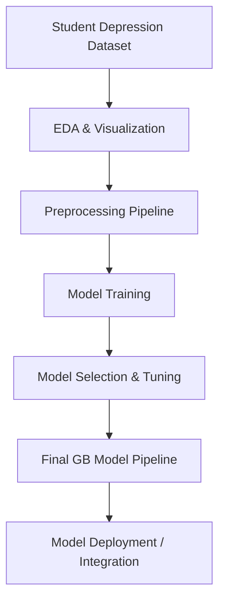
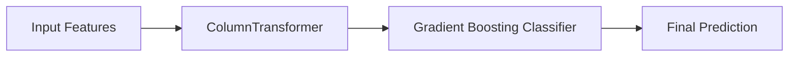
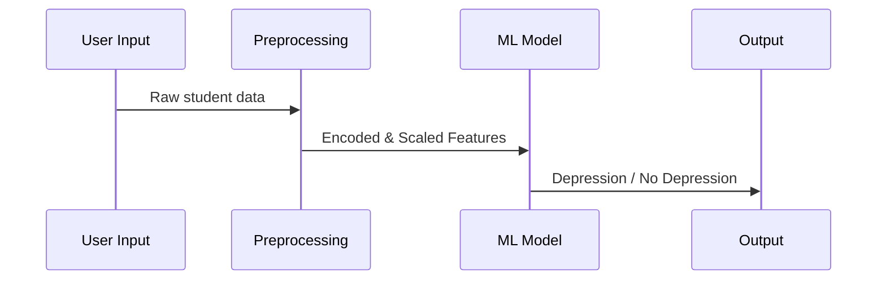

# 📘 Student Depression Prediction Using Machine Learning

## 🧭 Overview

Early detection of depression among students is essential for supporting mental well‑being, improving academic performance, and enabling timely intervention.  
This project uses machine learning to identify students who may be at risk of depression based on academic, behavioral, demographic, and lifestyle factors.

---

## 🎯 Why This Project Matters

### Rising Concern
- Increasing academic workloads  
- Social isolation and stress  
- Career uncertainty  
- Poor sleep and lifestyle habits  

### Why ML Helps
Traditional screenings are:
- Infrequent  
- Manual  
- Resource‑intensive  

A scalable ML solution can act as an early‑warning system for institutions—not a diagnosis tool, but a **supportive analytical system**.

---

## 📁 Project Architecture



---

## 🔍 Dataset Summary

- **27,901 records**
- **16 structured features**
- No missing values
- Clean and ready for ML pipelines

---

## 🧪 Technical Workflow

### 1. Exploratory Data Analysis
- Distribution plots  
- Correlation heatmaps  
- Target class balance  
- Trend identification  

### 2. Preprocessing
- Numerical scaling  
- Categorical encoding  
- ColumnTransformer-based automated pipeline  

### 3. Modeling
Models trained and compared:
- Logistic Regression  
- Random Forest  
- Gradient Boosting  
- XGBoost  
- AdaBoost  

### 4. Best Model



**Tuned Gradient Boosting Classifier**  
- `n_estimators=200`  
- `learning_rate=0.2`  
- `max_depth=2`  
- `subsample=0.8`  

### 5. Model Export
Saved as:

```
gradient_boost_tuned_model.joblib
```

Contains full pipeline + preprocessing.

---

## 🛠️ How to Run

### Install dependencies:
```
pip install -r requirements.txt
```

### Launch Jupyter:
```
jupyter notebook
```

Run:
- EDA.ipynb
- Model Training.ipynb

### Predict using saved model:
```python
import joblib, pandas as pd

model = joblib.load("gradient_boost_tuned_model.joblib")
sample = pd.DataFrame({...})
print(model.predict(sample))
```

---

## 📈 System Diagram (End‑to‑End)



---

## 🔒 Ethical Considerations

- Not a clinical diagnosis  
- Supports awareness only  
- Requires human review  
- Must not be used for punitive academic decisions  

---

## 🚀 Future Enhancements

- Streamlit / Flask deployment  
- SHAP interpretability dashboard  
- Bias & fairness auditing  
- Docker container  
- Automated unit tests  
- Modular Python scripts  

---
